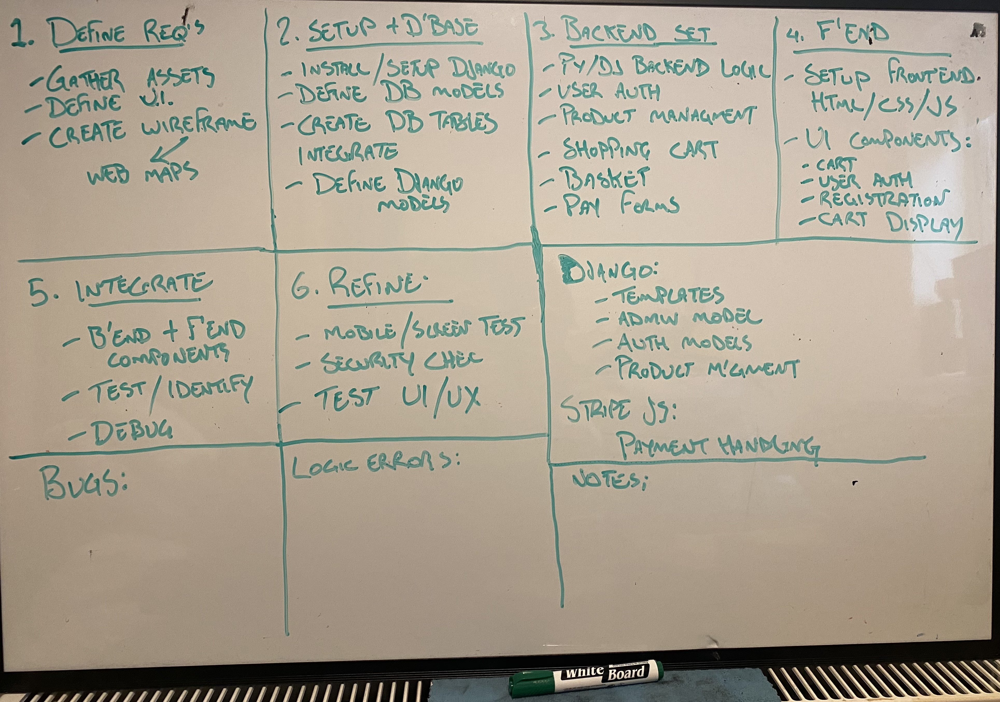
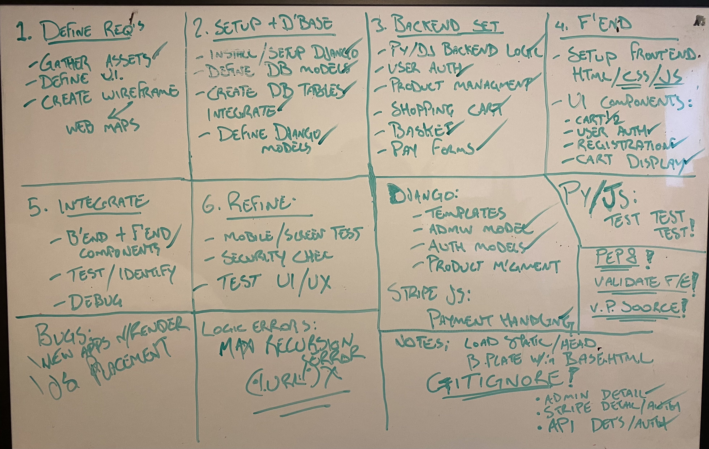
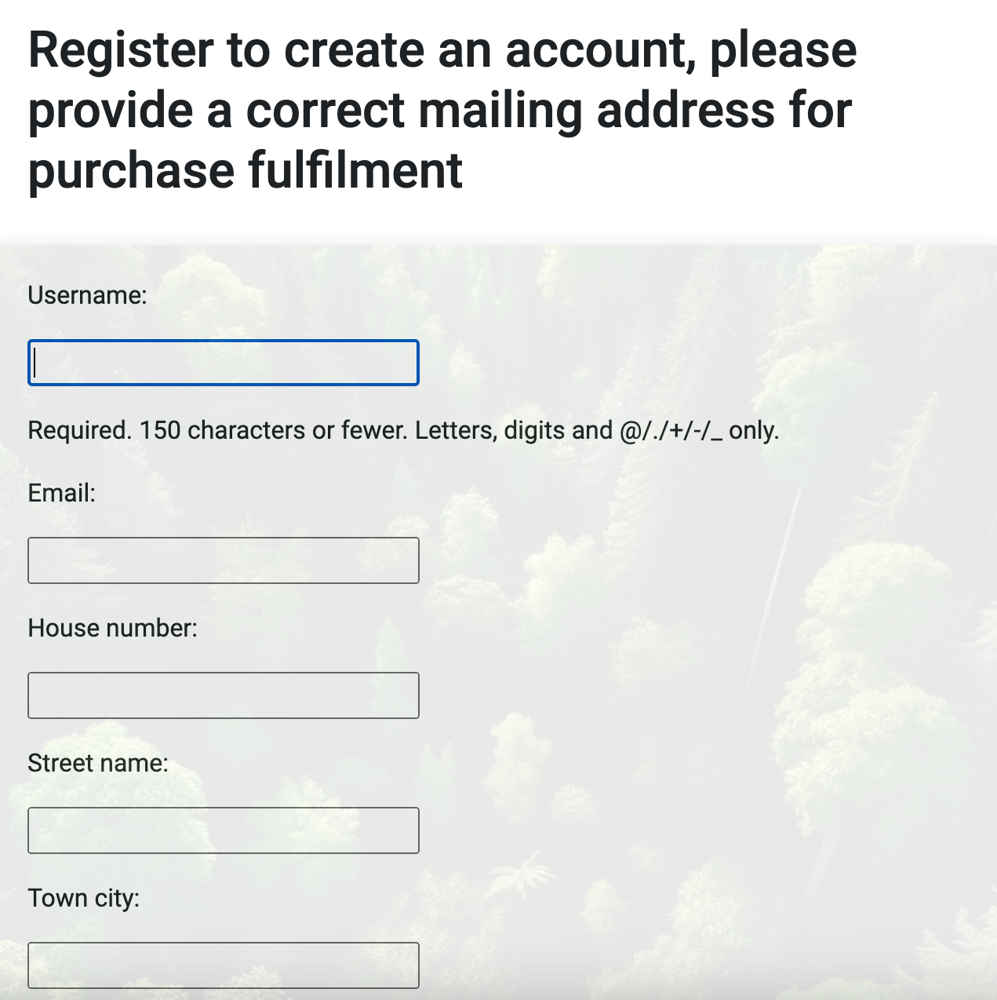
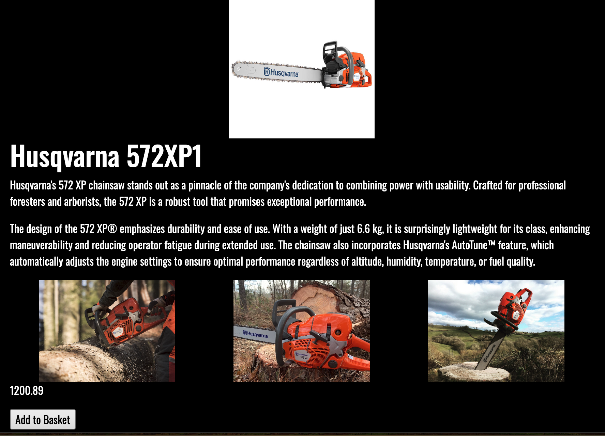
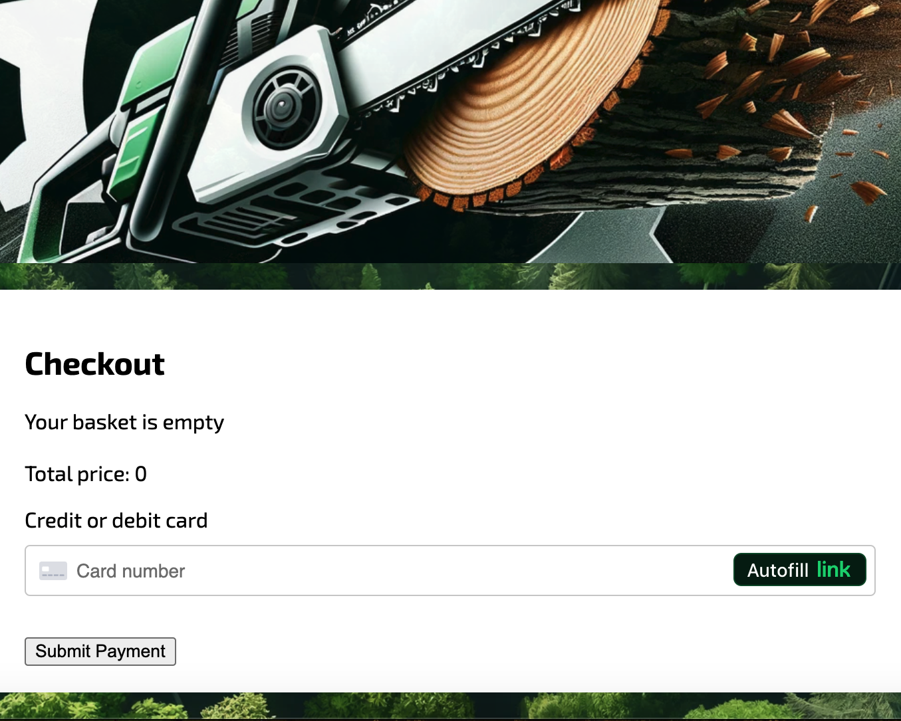
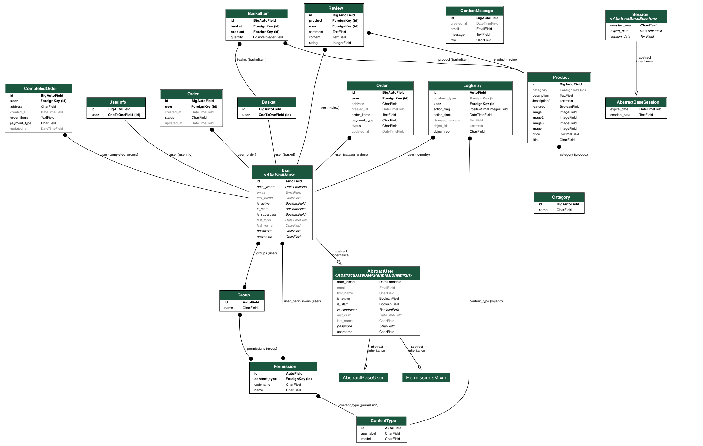
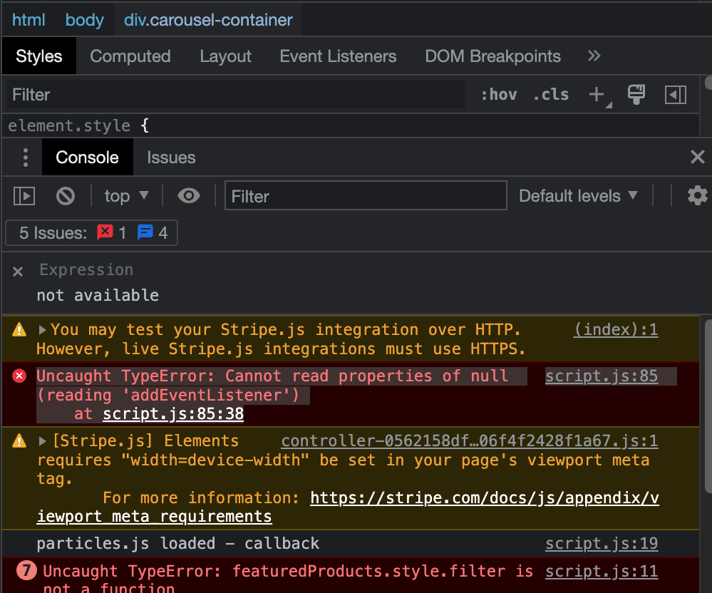
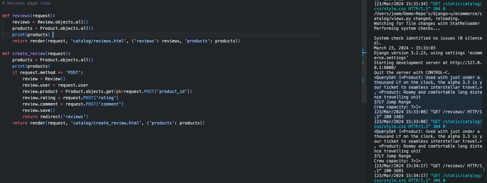
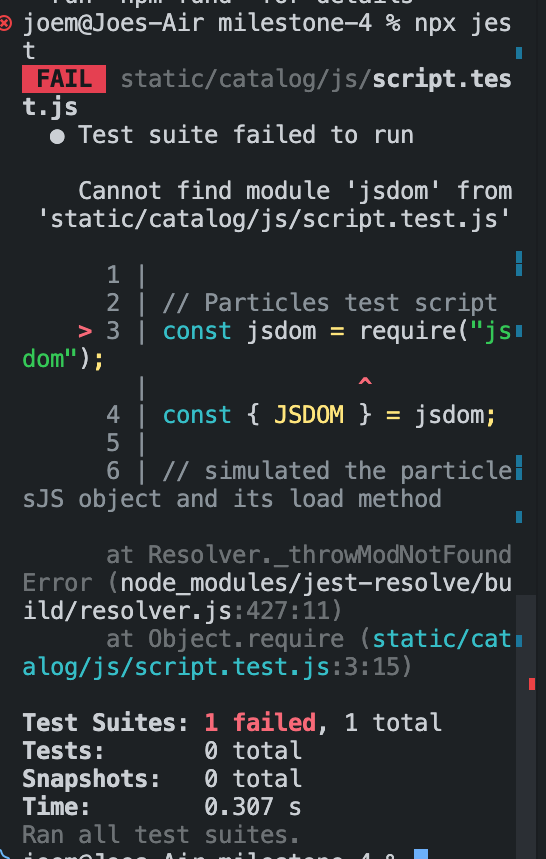
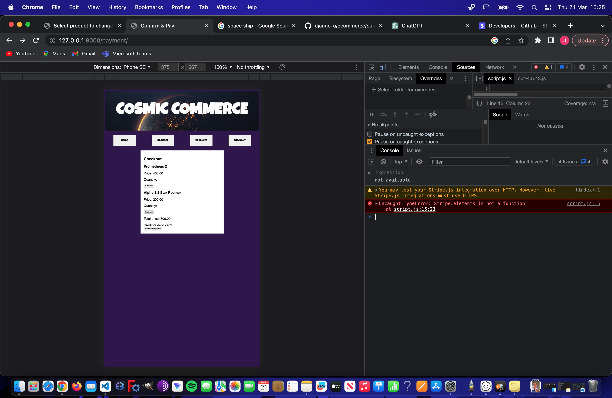

# Heavy Metal Modern Machinery 

## Table of Contents
- [Description](#description)
- [Usage](#usage)
- [Features](#project-features)
- [Bugs](#bugs-and-resolutions)
- [Further Info](#summary)

## Description

Heavy Metal Modern Machinery is a fullstack Django application of which the primary use is to navigate a well compiled and attractive front-end deisgned using HTML/CSS/Javascript, create a user profile which interacts safely with the project database, amend user details if necessary inside the dashboard view and place and fulfill orders using the Stripe payment function on the checkout page. The site primarily caters to forestry experts and enthusiasts in need of heavy equipment, protective personal gear and a small selection of forestry related power tools, thus giving the site a functional goal and purpose upon completion.

## Development

Milestone 4 began development as a mock e-commerce application catering to science fiction equipment, heavily reliant on front end java script libraries for animation such as particles and p5, using page wrappers to amplify a science fiction aesthetic, and an overconvoluted user experience. After initial deployment, and failure, the project was strippped to its functional bare template, isolating all well functioning elements and redesigning the front end to cater to a realistic and smooth user experience. The move to a more realistic approach gave a more valid development environment, focusing on the real world functional aspects of e-commerce software development and writing cleaner and less verbose Python/Javascript. 

### Planning

Planning Milestone 4 which eventually became Heavy Metal Modern Machinery, required taking a new approach to web design through the environment of a full stack engineer. It began with a physical checklist wrtitten on a white board of prospective features and processes required to complete a full stack e-commerce platform. 

It was then time to begin dratfing a sitemap and wireframe which although pointed towards the destination of Cosmic Commerce(MS4 first-attempt), was then utilised post site tear down as a map to become the site intended. Javascript libraries and JSON packages were attempted and tested in external environments and migrated to embody a science fiction theme through the project, page wrappers and loaders, background particle animations, and on-click animations. These features along with many javascript functions for animation were eventually scrapped due to page load and efficiency but were vital tools in starting to understand the importance and structure of JSON packages and how JS can and should be used to enhance the user experience. 

Once the front-end had effectively embodied the style of Heavy Metal Modern Machinery as intended, it was time to integrate the python back end pieces to complete the e-commerce concept. This included installing multiple libraries and applications to develop User, Product, Catalog models and integrating them, whilst also attempting to customise the Django admin feature to better suit MS4's needs. 

Post back end integration it was time to begin testing site features, attempting to pen-test the database using basic injection techniques, renaming and formatting style rules, checking python functions and destroying ghost code which was utilising valuable site power. Throughout the entirety of the process, ticking and checking off as well as adding to the physical white board and note pad which acted as a comfortable and familiar guide throughout the build.

## Usage
As a prospective user of the Heavy Metal e-commerce site my primary goals are to:
* Browse products
* Create a user profile
* Amend user details
* Place and fulfill orders

As a designated admin or superuser of teh Heavy Metal ecommerce site my primary goals are to:
* Easily add/remove/update products 
* Interact with user data as well as admin data and assign necessary privileges to ranked    users
* View placed orders and assign custom details to each order (pending, completed)
* If necessary remove or add user data for database customisation within an easy to navigate dashboard.
* Amend front-end/back-end functionality by working through an easy to navigate and well designed site structure. 

## Project features 

## User Authentication and Registration

- **User Registration**: New users can sign up for an account using our registration form.
- **User Login and Logout**: Users can log in to access their accounts and log out when they're done. As well as update their existing user details within the project dashboard.

## Product Catalog

- **Product Display**: Our homepage displays featured products, offering a quick glance at some of our top items.
- **Product Details**: Customers can view detailed information about a product by visiting the product detail page.
- **Category-based Browsing**: Products are organized by categories, making it easy for customers to browse items of interest.

## Shopping Basket

- **Adding Products to Basket**: Users can add products to their shopping basket, with the option to adjust quantities.
- **Basket Management**: Users can view, update, or remove items from their basket.
- **Checkout Process**: The checkout view allows users to review their basket items before proceeding with the purchase.

## Order and Payment

- **Checkout and Payment**: Integrated with Stripe for secure payment processing, allowing users to complete their purchase with ease.
- **Order Management**: After payment, an order record is created, detailing the purchased items and the user's information.

## Contact Form!(in production)

- **Customer Feedback**: A contact form is available for users to send messages or feedback directly to the site administration.!

## Additional Features

- Custom login view to redirect already authenticated users.
- Use of Django's built-in decorators for function-based views to require user authentication where necessary.
- Implementation of CSRF protection for form submissions.

This platform is built using Django, leveraging its powerful "batteries-included" features for web development and its secure, user-friendly authentication system.

## Data-base management structure and overview

Heavy Metal Modern Machinery leverages a comprehensive database structure aimed at delivering an easy to manage user experience, efficient product management, and effective order processing. The following entities form the core of our sqlite3 database:

#### User
Represents the registered users of the platform. Inherits from Django's `AbstractUser` for immediate access to authentication functionalities. Includes attributes for usernames, passwords, email addresses, and profile details such as shipping addresses.

#### Group and Permission
These are part of Django's built-in authentication system, providing role-based permissions and access controls.

#### Basket and BasketItem
`Basket` is linked to a `User` and can contain multiple `BasketItem`s, which in turn are related to `Product`s. This setup manages the shopping basket features.

#### Product and Category
`Product` holds all details of the items for sale, including titles, descriptions, pricing, and images. Each product is associated with a `Category`, facilitating organized navigation and product browsing.

#### Order and CompletedOrder
Post-checkout, an `Order` record is generated capturing the purchase details, user information, and address. `CompletedOrder` may represent the finalized transaction records.

#### ContactMessage(!in production)
Stores messages from the contact form, enabling user-administration communication.

#### LogEntry
Automatically records system changes, providing an audit trail for administrative actions.

This schema forms the backbone of Heavy Metal Modern Machinery platform's database.

## Bugs and Resolutions

### Module Import Errors in Reviews App
**Issue:** While creating the reviews app, module import errors occurred due to conflicting application names and paths.
**Resolution:** Renamed the conflicting applications and adjusted the import paths accordingly. The `reviews` module definitions were rewritten and validated through isolated offline tests to ensure compatibility and functionality.

### Reviews Not Stored in Database
**Issue:** Naming conventions and model configurations were incorrect, which prevented reviews from being saved to the database.
**Resolution:** Reviewed and revised model field names and relationships to ensure data integrity and proper association between reviews and related entities. Conducted migrations to implement the updated models.

### Featured Products Styling
**Issue:** New 'Featured Products' functionality required specific styles that could not be inherited from parent elements.
**Resolution:** Implemented secondary styling dedicated to 'Featured Products', ensuring that the new functionality had a distinct and appealing visual presentation without inheriting unrelated styles.

### Deployment Failure on Heroku
**Issue:** The project encountered a complete failure during the deployment process to Heroku due to incorrect file structure.
**Resolution:** Reorganized the file structure to meet Heroku's deployment requirements. Ensured all necessary configuration files were present and correctly set up for Heroku's build process.

### Incomplete requirements.txt File
**Issue:** The `requirements.txt` file was incomplete, requiring manual addition of each package due to not following the correct template.
**Resolution:** Regenerated `requirements.txt` using `pip freeze` to accurately capture the current environment's packages. Manually verified and added any missing dependencies to ensure a complete and accurate requirements file.

### Conflicting JavaScript Instances
**Issue:** Having two instances of particles animation on the loading wrapper  during the first rendition of my MS4 Project which caused  debilitating JavaScript conflicts, preventing proper loading.
**Resolution:** Removed one instance of the particles animation and implemented a p5.js script to provide the intended visual effect. This allowed the preservation of the `particles.js` library functionality without causing conflicts.

### Stripe Payment Integration Errors
**Issue:** Users encountered errors with Stripe payment processing when entering card or user information.
**Resolution:** Investigated the Stripe integration setup to identify configuration or code errors. Ensured that API keys were correctly set and that the payment form was correctly handling user input. Tested the payment flow multiple times to ensure reliability and security.

## Installation

To install Heavy Metal Modern Machinery as a template for future projects simply navigate to https://github.com/JoeMille/milestone-4-2, copying the root URL and cloning within your projects terminal. This will download the full Django project available for further customisation. Cloning this project will require user to create their own personal API secret keys for Stripe which until completing will render payment function use impossible. Once your project is prooperly installed and ensuring that manage.py and related files are at the root directory of your project, open a terminal and input the command: python3 manage.py runserver. This will render your project to the browser for devlopment view. 

Once the cloned project is ready for deployment, list all project requirements within a requirements.txt file at the root directory, inputting the command: pip3 install -r requirements.txt. Once completed, create a new Heroku application by navigating to your Heroku dashboard and creating a new application. Finally, commit all staged changes to your git repository and input the terminal command: git push heroku main. Wait whilst heroku uploads all changes to the hosted application and once successfully deployed, navigate to your heroku dashboard and launch your newly compiled application. 

To view Heavy Metal Modern Machinery in its active state please navigate to https://heavymetalmodernmachinery-4f53d0f57205.herokuapp.com/

## Summary

MS4 (Mileston-Project-4) proved to be the most difficult of all combined projects as it required embodying all elements learned and practiced throughout the last three modules, often times pushing development back to refresh knowledge of the priciples of each module. A personal mountain to hike was anything javascript related, at first I not only, admittedly, feared the language but also avoided it's use. This is a humongous regret in hindsight as it has now become the most interesting and versatile language I have yet been exposed to. Trying to highlight my huge appreciation of the language the original rendition of this project utilises open source javascript libraries that bear the weight of the "interactive-sci-fi" aesthetic as well as the sites payment model which had been originally designed. In the future I hope to continue to expand my understanding of all modules content and truly hope that Heavy Metal Machinery is a firm representation of what can be learned via the SDC/CI syllabus and what features and personality I can personally bring to the project table. I hope this project is an enjoyable perusal, especially for gardening or deep woods forestry enthusiasts.

Kindest of thanks for reading and exploring, and please feel free to follow this account for future releases and projects as well as view my personal progression through past projects.

For access to original renditions of this project please navigate to: github.com/JoeMille/milestone-4, which unfortunately was torn down and essentially repurposed for the updated and more easy to navigate/less eccentric Heavy metal Machinery.

## Dependencies

- `stripe`: For handling Stripe payments.
- `django.conf.settings`: For accessing Django settings.
- `django.http.JsonResponse`: For returning JSON responses.
- `django.shortcuts`: For rendering templates, redirects, and getting objects from the database.
- `django.http.HttpResponse`: For returning HTTP responses.
- `django.contrib.auth.forms.UserCreationForm`: For user registration.
- `django.contrib.auth.forms.AuthenticationForm`: For user authentication.
- `django.contrib.auth.login`: For user login.
- `django.views.decorators.csrf.csrf_exempt`: For exempting views from CSRF protection.
- `.models`: For importing models (`Category`, `Product`, `Basket`, `BasketItem`, `Review`, `ContactMessage`) from the same application.
- `django.contrib.auth.logout`: For user logout.
- `django.db.models.Prefetch`: For optimizing database queries.
- `django.core.mail.send_mail`: For sending emails.
- `.forms`: For importing forms (`ContactForm`) from the same application.

## Frontend Libraries

### JavaScript Libraries

- **jQuery**: JavaScript library for simplifying HTML DOM traversal and manipulation, as well as event handling.
  
### CSS Libraries

- **Bootstrap**: Frontend framework for building responsive and mobile-first websites.
- **Font Awesome**: Icon set and toolkit for web development.
- **Google Fonts**: Collection of free and open-source fonts provided by Google.

## Acknowledgements

- `Particles.js`: A prominent feature in the original iteration of the project.
- `W3 Schools`: A notable open source online academy utilised for extensive front end lessons.
- `Code Academy`: Open source online academy. 
- `Code Institute`: Providing all education and assistance relevant to milestone projects. 